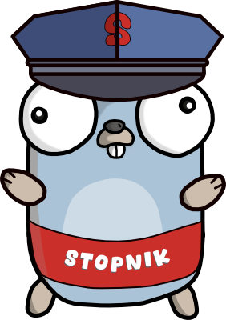

    <picture>
      
    </picture>

# STOPnik

The simple and small `OAuth2 | OpenId Connect` server that can secure your applications without hassle.
STOPnik does not have any persistence layer and will only work with the clients and users defined in the `YAML` configuration file.
When restarted, all issued tokens will become invalid/forgotten by STOPnik.

